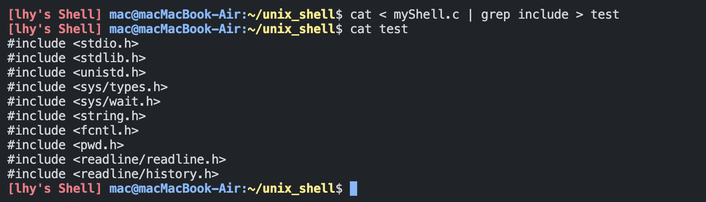

# A Simple Shell in 300 Lines of C
这是一个使用 C 语言实现的简易类 UNIX Shell，总代码量约为 300 行。它支持基本的交互功能、外部命令执行、I/O 重定向、管道和脚本运行等功能。

## ✨ 功能简介
- 使用第三方库 readline 提供更自由、智能的输入体验：支持命令历史（↑↓键查看）与简单的自动补全功能。
- 支持带参数的外部命令：可执行如 ls -l、gcc test.c -o test 等命令。
- 内建命令支持：实现了 cd（切换目录）和 exit（退出 Shell）等基本内建命令。

- 支持带一个管道符的命令 |：如 ls | wc，可进行简单的进程间通信。
- 支持 I/O 重定向：包括输入 <、输出 >、追加输出 >> 的重定向操作。

- 支持执行 Shell 脚本文件：可运行包含一系列命令的脚本文件（如 test.sh）。


## 使用方法
```shell
sudo apt-get install libreadline-dev
gcc myShell.c -lreadline -o myShell
./myShell
```